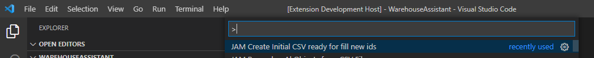
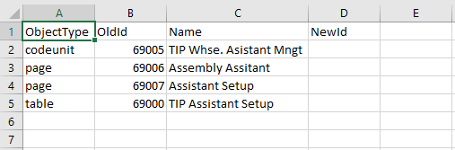
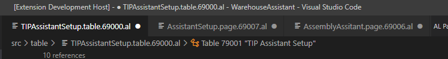

# JAMRenumbering README

This extension implements the old renumbering utility from C/AL to AL.

## Features

This Renumber implementation has two steps, with two commands:

Goto to command palette and find "JAM Create initial CSV file":

This command create a CSV template from workspace objects with NewID empty:

When you fill this column you can go to next step: Renumber. The command will ask where do you want to save CSV file.

Goto to Command palette and find "JAM Renumber Al Objects from CSV file":

Command will ask the source CSV file with the renumbering and excute renumbering over all AL objetcs in current workspace. At the end of command changed objects will be open in the editor, and you can review and save all or discard this renumbering:

## Requirements

Visual Studio Code and AL language.

## Extension Settings

No setup needed.

## Known Issues

Not yet.

## Release Notes

### 1.0.0

Initial release.
